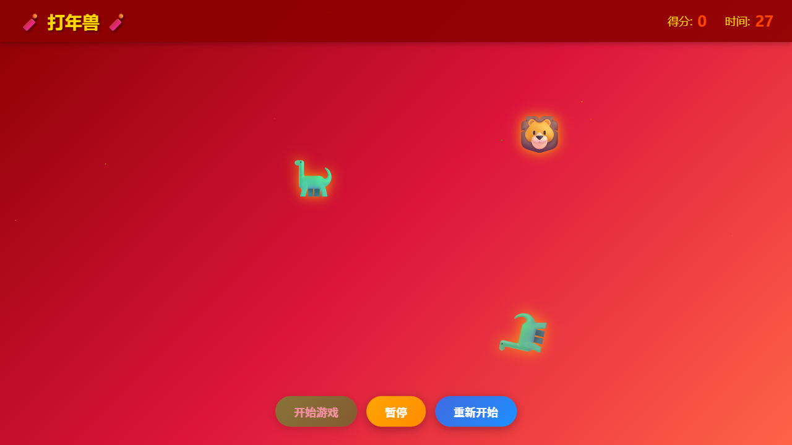
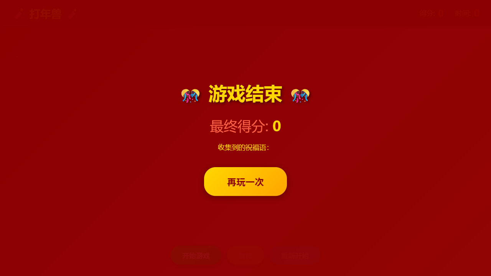

# 【新春创造营】打年兽 - 春节祝福语小游戏

## 🎮 项目简介

"打年兽"是一款春节主题的互动小游戏，灵感来自中国传统传说"年兽"的故事。玩家需要在限定时间内点击屏幕上随机出现的年兽，每击中一只年兽就能收到一个随机的新春祝福语。游戏旨在通过轻松有趣的方式传递春节的喜庆氛围和美好祝福。

### 主要功能
- ⏱️ 30秒倒计时挑战
- 🎯 点击年兽得分机制
- 🧧 30条精选春节祝福语随机展示
- ⏸️ 支持暂停/继续功能
- 🔄 支持重新开始
- 🎆 动态烟花背景效果
- 📱 响应式设计，支持移动端

---

## 🛠️ 使用 iFlow CLI 完成的项目

本项目完全使用 **iFlow CLI** 完成开发，充分发挥了 AI 编程助手的优势。以下是使用到的 iFlow CLI 功能：

### 1. 智能任务规划
- 使用 `todo_write` 工具进行项目任务拆解和进度管理
- 将复杂项目分解为：HTML结构 → CSS样式 → JavaScript逻辑 → 游戏控制 → 测试验证
- 实时跟踪开发进度，确保功能完整实现

### 2. 自动代码生成
- 一次性生成完整的 HTML/CSS/JavaScript 单文件游戏
- 自动实现游戏核心逻辑：计时器、计分系统、年兽生成算法
- 智能生成祝福语库和随机抽取机制

### 3. 视觉效果设计
- 自动设计春节红色主题配色方案
- 实现烟花背景动画、年兽出现/消失动画、击中特效
- 确保视觉设计符合春节喜庆氛围

### 4. 游戏逻辑实现
- 使用事件监听处理用户交互
- 实现 DOM 操作动态生成年兽元素
- 计时器和状态管理系统

### 5. 自动化测试验证
- 使用浏览器自动化工具测试游戏功能
- 验证开始、暂停、重新开始等控制功能
- 确保游戏在不同场景下正常运行

---

## 💡 实现过程

### 第一阶段：需求分析与规划
1. 分析活动要求，确定"打年兽"游戏创意
2. 拆解功能模块：游戏界面、年兽系统、祝福语系统、计分计时系统
3. 创建任务清单，明确开发优先级

### 第二阶段：核心代码生成
使用 iFlow CLI 一次性生成完整的游戏文件：
- **HTML 结构**：创建游戏界面框架，包括开始界面、游戏区域、控制按钮、结束界面
- **CSS 样式**：
  - 设计春节红色渐变背景（#8B0000 → #DC143C → #FF6347）
  - 实现烟花背景动画效果
  - 年兽出现/消失的动画效果（appear/disappear）
  - 祝福语弹窗动画（popupShow）
  - 击中特效（hitEffect）
  - 响应式布局适配移动端
- **JavaScript 逻辑**：
  - 祝福语库：30条春节祝福语
  - 年兽表情数组：🦁、🐅、🐯、🦕、🐲
  - 游戏状态管理：分数、时间、游戏状态
  - 年兽生成函数：随机位置、随机表情、定时消失
  - 点击检测与祝福语显示逻辑
  - 计时器和游戏结束判断

### 第三阶段：功能完善
1. 添加键盘快捷键支持（空格键开始/暂停，R键重新开始）
2. 优化动画流畅度和视觉效果
3. 添加击中特效（✨）
4. 实现收集的祝福语显示功能

### 第四阶段：测试验证
1. 在浏览器中打开游戏进行功能测试
2. 测试开始、暂停、继续、重新开始流程
3. 验证年兽生成和点击交互
4. 确认祝福语弹窗正常显示
5. 测试游戏结束界面和再玩一次功能

---

## 🎨 截图展示

### 游戏开始界面

*显示游戏标题"🎉 打年兽 🎉"、游戏规则说明和"开始游戏"按钮*

### 游戏进行中

*年兽（🦁、🐅、🐯、🦕、🐲）在屏幕上随机出现，玩家点击击中后会弹出春节祝福语，界面实时显示得分和剩余时间*

### 游戏结束界面

*游戏时间结束后显示最终得分、收集到的祝福语列表，以及"再玩一次"按钮*

---

## 🚀 体验链接

**在线体验**：[https://cods.webredirect.org/nianshou/](https://cods.webredirect.org/nianshou/)

**游戏下载地址**：`index.html`

**使用方法**：
1. 在线体验：直接点击上方链接即可游玩
2. 本地运行：下载 `index.html` 文件后双击在浏览器中打开
3. 点击"开始游戏"按钮开始挑战
4. 用鼠标点击屏幕上的年兽收集祝福语
5. 在30秒内尽可能获得高分！

**推荐浏览器**：Chrome、Firefox、Safari、Edge（最新版本）

---

## 📊 开发成果

- **代码量**：776 行（包含 HTML、CSS、JavaScript）
- **开发时间**：使用 iFlow CLI 完成约 15 分钟
- **文件大小**：约 25KB（纯文本，无外部依赖）
- **兼容性**：支持所有现代浏览器

---

## 🎉 活动感想

通过 iFlow CLI 完成这个新春小游戏，深刻体会到了 AI 编程助手带来的效率提升：

1. **快速原型开发**：从创意到可运行的游戏仅需几分钟
2. **代码质量保证**：自动生成的代码结构清晰、逻辑完整
3. **任务管理便利**：内置的 todo 系统帮助跟踪开发进度
4. **自动化测试**：集成浏览器测试工具确保功能正常

这个"打年兽"游戏不仅符合春节主题，还能让玩家在游戏中感受到传统文化的魅力。每一声祝福语都是对新一年的美好期盼！

---

**祝大家新春快乐，万事如意！🧨🎊**

---

*项目使用 iFlow CLI 创建 | 2026年2月9日*